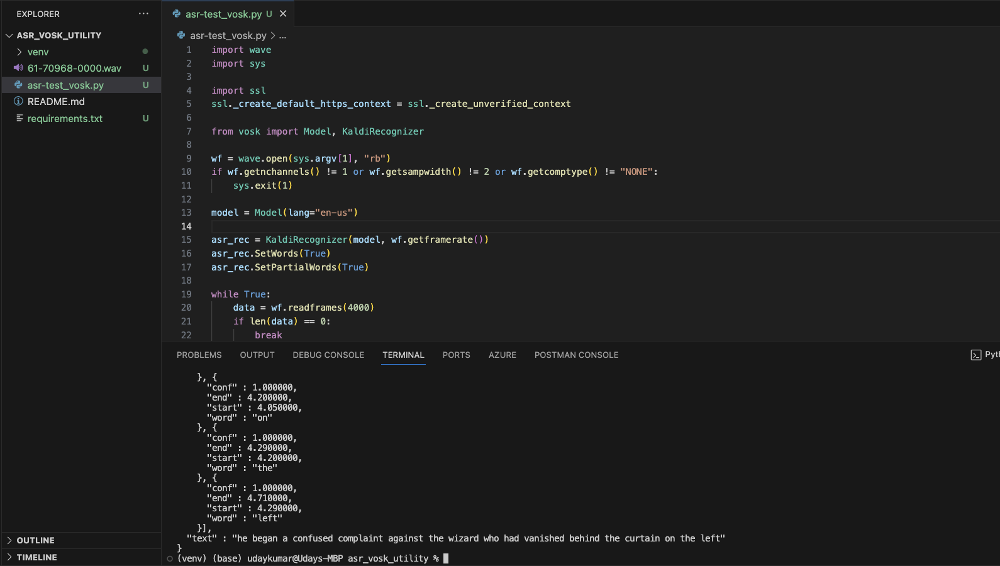

# asr_vosk_utility


Vosk is a speech recognition toolkit. The best things in Vosk are:
Supports 20+ languages and dialects - English, Indian English, German, French, Spanish, Portuguese, Chinese, Russian, Turkish, Vietnamese, Italian, Dutch, Catalan, Arabic, Greek, Farsi, Filipino, Ukrainian, Kazakh, Swedish, Japanese, Esperanto, Hindi, Czech, Polish, Uzbek, Korean, Breton, Gujarati, Tajik. 

Works offline, even on lightweight devices - Raspberry Pi, Android, iOS
Provides streaming API for the best user experience (unlike popular speech-recognition python packages)
There are bindings for different programming languages, too - java/csharp/javascript etc.
Allows quick reconfiguration of vocabulary for best accuracy.


## How to Run?

```
    python asr-test.py 61-70968-0000.wav
```

## Result:

